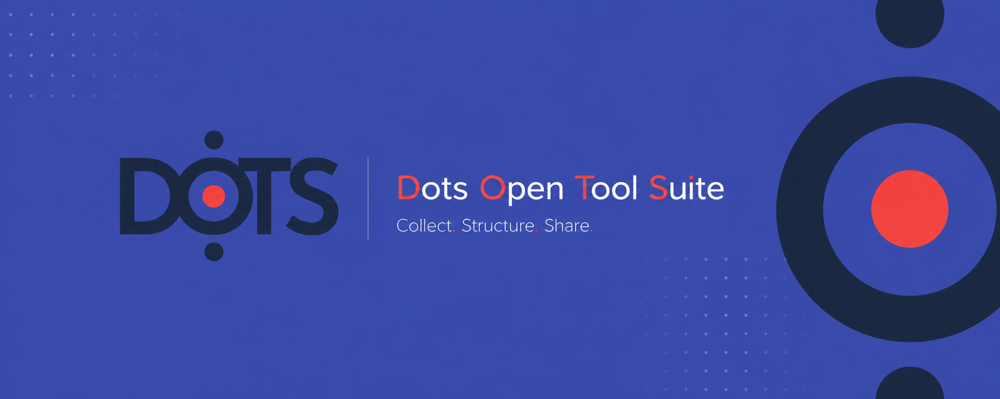

  
  
⭕ <b>DoTS</b> is a FAIR and open-source ecosystem for publishing scholarly editions and promoting cultural heritage data 🔴

## 👩‍💻 Core project

| Project | Description |
|---------|-------------|
| **dots** | Core BaseX backend for DoTS. |
| **dots-vue** | Vue.js frontend for DoTS. |

## 🔌 Extensions / Plugins

| Project | Description |
|---------|-------------|
| **thunderdots** | Python crawler for scraping from DoTS. |

## 🧩 Example Settings

| Project | Description |
|---------|-------------|
| - | - |

## Funding

  
  These tools were developed at École nationale des chartes – PSL with Biblissima+.
    
   
  

 
