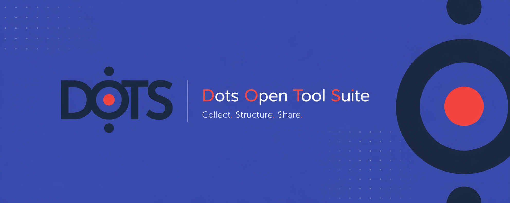
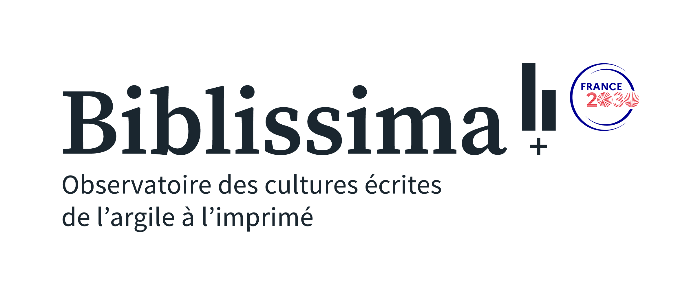

  
⭕ DoTS is a FAIR-compliant, open-source ecosystem for publishing and exploring scholarly editions, promoting cultural heritage data accessibility 🔴 
 

Each tool is independent and agnostic. DoTS-vue, ThunderDoTS, and DoTS-cli-es can be connected to any DTS-compliant API — whether DoTS itself or another implementation of the specification. DoTS-cli-es can optionally rely on ThunderDoTS for content indexing, though this is not required.

## 👩‍💻 Core project

|Resource|Description|
|---|---|
|**[DoTS](https://github.com/dots-suite/dots)**|An XQuery implementation of the [DTS (Distributed Text Services)](https://distributed-text-services.github.io/specifications/) API specification, running on BaseX, for the FAIR publication of TEI corpora.|
|**[DoTS-vue](https://github.com/dots-suite/dots-vue)**|A responsive web application for browsing and reading scholarly editions, providing a customisable Vue.js 3 interface for any DTS-compliant endpoint.|

## 🔌 Extensions / Plugins

|Resource|Description|
|---|---|
|**[ThunderDoTS](https://github.com/dots-suite/ThunderDots)**|A fast Python library for scraping DTS resources and converting them into Python objects, JSON, and DataFrames for downstream tasks.|
|**[DoTS-cli-es](https://github.com/chartes/dots-cli-es)**|A command-line tool to index DTS collections in Elasticsearch, turning DTS endpoints into searchable resources.|

Each module is designed to be simple to use, on its own or combined with the others — and to make these tools easier to adopt, significant effort has gone into the documentation.

## 📚 Documentation

|Resource|Description|
|---|---|
|**[DoTS documentation](https://dots-suite.github.io/dots_documentation/)**| Walks you through installing DoTS, and structuring and publishing a TEI corpus, and details the DTS API endpoints it implements, with example requests.|
|**[ThunderDoTS documentation](https://dots-suite.github.io/ThunderDots/)**| Covers installing and configuring ThunderDoTS, fragmenting TEI documents and validating their metadata, and exporting results to Elasticsearch, Qdrant, or DataFrames.|
|**Cookbooks**|The DoTS documentation provides [cookbooks](https://dots-suite.github.io/dots_documentation/cookbook/) for publishing sample corpora (the Théâtre corpus, the École des chartes' _Positions de thèses_, etc.). You can then browse our [DoTS-vue cookbooks](https://dots.chartes.psl.eu/cookbook/), showcasing the responsive scholarly-edition web application built on the same corpora for consistency. Each published corpus comes with its own step-by-step recipe, teaching you by example how to configure your own DoTS-vue instance.|

To help you understand the DoTS-vue configuration file, we also provide a sample configuration:

## 🧩 Example Settings

|Resource|Description|
|---|---|
|**[dots-vue-demo-settings](https://github.com/dots-suite/dots-vue-demo-settings)**|Example configuration settings for [DoTS-vue](https://github.com/dots-suite/dots-vue), dedicated to the [demo project](https://dots.chartes.psl.eu/vue-demo/).|

Producing FAIR data is only half the job — it also needs to stay conformant over time. The following tools help you check that your DTS API responses and DoTS-vue configurations remain valid against the specifications and schemas they rely on.

## 🛠️ Utilities & Validators

|Resource|Description|
|---|---|
|**[dots-dts-jsonld-inspector](https://github.com/dots-suite/dots-dts-jsonld-inspector)**|Lightweight tool for inspecting and validating the JSON-LD responses returned by a DTS (DoTS) API endpoint.|
|**[dots-vue-config-validator](https://github.com/dots-suite/dots-vue-config-validator)**|Validator for DoTS-vue configuration files, used to catch settings errors before deployment.|

## Resources

- <a href="https://hal.science/hal-05175910v1" target="_blank">DH2025, Lisbon, PT — FAIRly publishing your textual data with DoTS</a>
- EADH2026, Kraków, PL — _coming soon_

## Funding

   at École nationale des chartes – PSL, with support from Biblissima+.         
  
